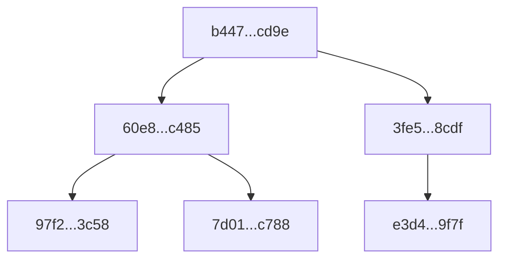
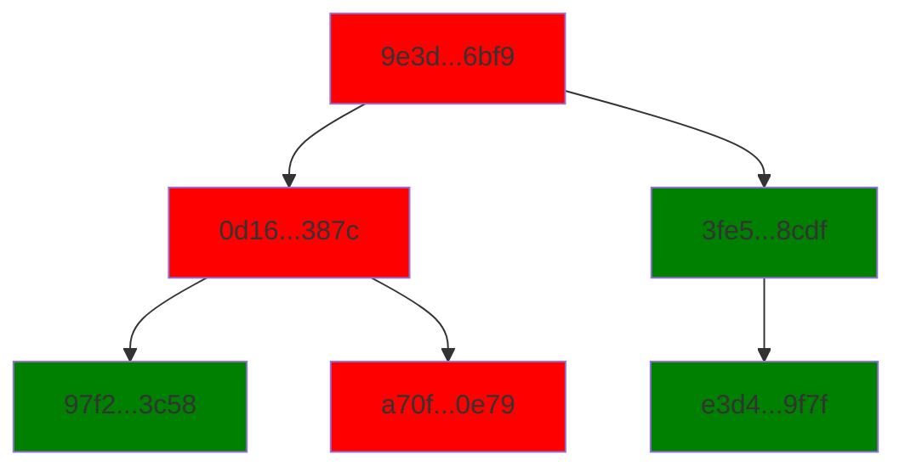

+++
date = 2024-07-02T12:00:00
title = 'Implementing a Merkle Tree in Python'
+++
In this article, we will implement a Merkle Tree in Python, a data structure used extensively in Blockchain technology and other systems requiring data integrity verification. By the end of this article, you will understand how Merkle Trees work, their benefits, what the Merkle Root is, and how to implement all of this in Python.

## The Merkle Tree

A *Merkle Tree* is a binary hash tree that hashes a collection of data blocks so that any change in the original data results in entirely different values throughout the tree. This makes it helpful in verifying the integrity of the data and tracking down changes efficiently through binary traversal.


The leaf nodes contain the hash value of each data block. The nodes are then grouped in pairs, their hashes are concatenated, and the resulting string is hashed again. This process continues until only one node, known as the Merkle Root, is left, marking the culmination of the Merkle Tree.

## The Merkle Root

The Merkle Tree's root node contains a hash dependent on all preceding hashes and, therefore, the underlying data blocks. This makes the *Merkle Root* a critical value, the cornerstone of data verification. It's the key to checking and verifying the entire collection of data blocks. In the case of a failing verification, a binary tree traversal can then be utilized to locate the faulty data block. Now, let's delve into how we can implement the Merkle Root in Python.

## Implementing the Merkle Root in Python

To generate the Merkle Root in Python, we can create a recursive function that takes a list of hashes as an argument.
You can choose any hash function, but in this example, we will extensively use SHA-256, which warrants creating a helper function that takes a string as an argument and returns its SHA-256 hash.

```python
import hashlib

def sha256(s: str) -> str:
    return hashlib.sha256(s.encode()).hexdigest()
```

We concatenate every hash pair, create a new hash using our new helper function above, and store it in a new list. We can then pass this new list into the same function and recursively reduce the number of hashes until only one is left, the *Merkle Root*.

```python
def get_merkle_root(hash_list: list[str]) -> str:
    new_hash_list = []
    for i in range(0, len(hash_list), 2):
        j = i + 1 if i + 1 < len(hash_list) else i
        string = hash_list[i] + hash_list[j]
        new_hash_list.append(sha256(string))
```

Above, we loop over the given list's length with a step of two. The chosen step size lets us compare the current iteration with the next without overlap. For example, if the incoming `hash_list` is of length four, our variable `i` will have the value of `0` in the first iteration and `2` in the second. To get a pair on every iteration, we simply access `hash_list[i]` and `hash_list[i+1]`.
In the code above, we created the variable `j`. When we have an odd number of hashes, we skip the `i+1` step for the final iteration and use `i` again to avoid an index error.

Now, we want to recursively reduce the length of the hash list by passing the new hash list into `get_merkle_root()` again.

```python
def get_merkle_root(hash_list: list[str]) -> str:

    if len(hash_list) == 1:
        return hash_list[0]

    new_hash_list = []
    for i in range(0, len(hash_list), 2):
        j = i + 1 if i + 1 < len(hash_list) else i
        string = hash_list[i] + hash_list[j]
        new_hash_list.append(sha256(string))
        
    return get_merkle_root(new_hash_list)
```

To avoid getting stuck in endless recursion, we define our base case at the top, returning the list's first (and only) value if the length equals one. We've almost handled every case now; lastly, let's write a final condition at the top for when we pass an empty list (for some reason).

```python
def get_merkle_root(hash_list: list[str]) -> str:
    """Return the Merkle root of a list of hashes.

    Args:
        hashes: A list of hashes.

    Returns:
        The Merkle root of the hashes

    """

    if not hash_list:
        return sha256("")

    if len(hash_list) == 1:
        return hash_list[0]

    new_hash_list = []
    for i in range(0, len(hash_list), 2):
        j = i + 1 if i + 1 < len(hash_list) else i
        string = hash_list[i] + hash_list[j]
        new_hash_list.append(sha256(string))

    return get_merkle_root(new_hash_list)
```

Here we are, a function that returns the *Merkle Root* for a given list of hash values.

## Transaction Data Structure

Because *Merkle Trees* are heavily used to hash and verify large lists of transactions, we will use this as an example for our implementation.

```python
from dataclasses import dataclass

@dataclass
class Transaction:
    sender: str
    receiver: str
    amount: int
    timestamp: str

    def to_hash(self) -> str:
        string = "".join(str(x) for x in vars(self).values())
        return sha256(string)
        
type Tx = Transaction
```

We implement a `to_hash()` method to concatenate all transaction values and generate a SHA-256 hash of the resulting string.

With this in place, we can create a wrapper of `get_merkle_root()` to accept a list of transactions.

```python
def get_tx_merkle_root(txs: list[Tx]) -> str:
    hashes = [tx.to_hash for tx in txs]
    return get_merkle_root(hashes)
```

Below, we printed the list of transactions, their hashes and finally, their Merkle Root.

```bash
# Transactions
[Transaction(sender='Alice',
             receiver='Bob',
             amount=20,
             timestamp='2021-09-01T12:00:00'),
 Transaction(sender='Bob',
             receiver='Charlie',
             amount=50,
             timestamp='2021-09-01T13:00:00'),
 Transaction(sender='Charlie',
             receiver='Alice',
             amount=10,
             timestamp='2021-09-01T15:00:00')]

# Hashes
['97f23869f74000cd28239454f83cd5870a13170aa5b27011d46e45e3674e3c58',
 '7d01a35827cb305c52618157fe9250c355f38b2bb9d91ee487a190cb7baac788',
 'e3d4444714fe6d0660ed7907c42d671d4e766c342fb331689146165e58f49f7f']

# The Merkle Root:
'b447dbac50e48a16111032928282bf168cfe648b31d628fd0d6198fb2943cd9e'
```

If we modify one of the transactions, we will see how one of the transaction hashes changed completely, which in turn changed the Merkle Root.

```bash
# Transactions
[Transaction(sender='Alice',
             receiver='Bob',
             amount=20,
             timestamp='2021-09-01T12:00:00'),
 Transaction(sender='Bob',
             receiver='Charlie',
             amount=51,
             timestamp='2021-09-01T13:00:00'),
 Transaction(sender='Charlie',
             receiver='Alice',
             amount=10,
             timestamp='2021-09-01T15:00:00')]

# Hashes
['97f23869f74000cd28239454f83cd5870a13170aa5b27011d46e45e3674e3c58',
 'a70fc1aaee70c3ebbf38eccd0005e6b0bf410b6f8a1f52e2480ded5753fe0e79',
 'e3d4444714fe6d0660ed7907c42d671d4e766c342fb331689146165e58f49f7f']

# The Merkle Root:
'9e3d45c68ec348363b23fe696c9f1d638224d6f195ffd03a3bff3ae6b1ed6bf9'
```

## Implementing a Merkle Tree in Python

If we want to track down which transactions need to be fixed, our approach needs to be revised since the *Merkle Root* can only tell us that something is wrong, but not exactly what. We can create a node data structure to hold a given hash value and, optionally, a left and right child node.

```python
@dataclass
class MerkleNode:
    value: str
    left: MerkleNode | None = None
    right: MerkleNode | None = None
```

This function will be very similar to the one creating the Merkle Root.

```python
def get_merkle_tree(nodes: list[MerkleNode]) -> MerkleNode:
    if not nodes:
        return MerkleNode(sha256(""))

    if len(nodes) == 1:
        return nodes[0]

    # --snip--
```

Instead of a list of strings, we now pass a list of nodes as the argument and return a single node.
Most of the change happens in the for-loop.

```python
    # --snip--
    new_nodes = []
    for i in range(0, len(nodes), 2):
        left = nodes[i]
        if i + 1 < len(nodes):
            right = nodes[i + 1]
            string = left.value + right.value
        else:
            right = None
            string = left.value + left.value
        new_node = MerkleNode(sha256(string), left=left, right=right)
        new_nodes.append(new_node)

    return get_merkle_tree(new_nodes)
```

The range parameters and how we check if the value of `i+1` exceeds the list length stay the same. We concatenate the two hashes and create a new one like before. The main difference is that we wrap the hash in the Merkle node and, most importantly, store the two nodes we are currently processing as the left and right children of the new node. In the else block, we assign the right node to `None`, marking this child as missing.

```python
txs = [
    Transaction("Alice", "Bob", 20, "2021-09-01T12:00:00"),
    Transaction("Bob", "Charlie", 50, "2021-09-01T13:00:00"),
    Transaction("Charlie", "Alice", 10, "2021-09-01T15:00:00"),
]

tx_nodes = [MerkleNode(tx.to_hash()) for tx in txs]
tx_tree = get_merkle_tree(tx_nodes)
```

We create our transactions again and wrap their hashes into nodes. We then pass them into our new function and store the result in the variable `tx_tree`.



Revisiting our previous chapter, the verification process begins with the root node's hash value, which starts with `b447` and ends with `cd9e`. Equally important are the 'three leaf nodes' at the bottom, which store the original hash representation of our three transactions. The tree's benefit lies in its ability to display all the branch nodes. Let's now proceed to create another tree with a slightly modified transaction.



Comparing both trees, we can colourize the nodes of this tree green or red, whether or not they match the previous one, our ground truth. This visualization shows us that the second transaction from the left (Bob sending 50 units to Charlie) has been tampered with.

## Conclusion

Whether used for encoding transactions, verifying software updates, or ensuring the integrity of large data sets, the principles behind Merkle Trees highlight their versatility and importance in maintaining data security and reliability.
